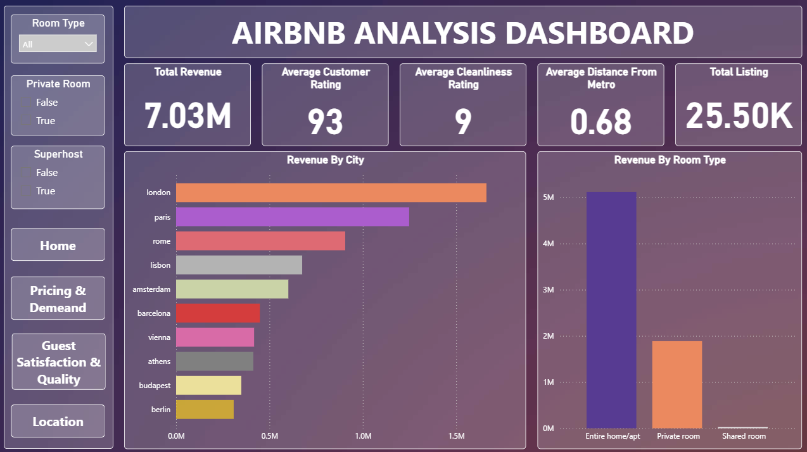

# AIRBNB ANALYSIS DASHBOARD

## Project Overview

This interactive Power BI dashboard provides a detailed analytical view of Airbnb listings across multiple European cities.
The main objective of this project is to examine total revenue, guest satisfaction, cleanliness ratings, listing types, metro distance impact, and geographical distribution of properties.

## Project Objective

* Visualize total revenue and total listings by city.
* Compare revenue by different room types (Entire home/apt, Private room, Shared room).
* Identify how guest satisfaction and cleanliness ratings affect revenue.
* Understand whether Superhosts perform better than non-superhosts.
* Analyze the effect of metro distance on pricing.
* Show geolocation distribution of listings using latitude & longitude.

## Key KPIs

* Total Listings: 25,500
* Total Revenue: 7.03M
* Average Guest Rating: 92.59
* Average Cleanliness Rating: 9.39
* Superhost Percentage: 25.85%
* Revenue by Room Type
* Revenue by City

## Analytical Questions Answered

* Which city is generating the highest revenue?
* Which room type contributes the most to overall revenue?
* Do listings closer to metro stations earn more?
* Do superhosts maintain better cleanliness ratings?
* What is the relationship between satisfaction score and pricing?
* Which city has the cleanest Airbnb properties?
* Which room type receives the highest guest satisfaction?
* How is the geographical distribution of listings across cities?

## Tools and Technologies

* Microsoft Power BI — for dashboard creation
* MySQL — used for KPI and insights extraction using SQL queries
* Python (Jupyter Notebook) — for data cleaning and null value checks
* MS Excel (Power Query) — for merging multiple dataset files and datatype formatting

## Process

* Inspected and merged multiple files in MS Excel using Power Query.
* Cleaned null and garbage values in Jupyter Notebook using Python.
* Imported the cleaned dataset into MySQL database.
* Executed SQL queries to obtain major KPIs and insights.
* Loaded the processed dataset into Power BI.
* Created visuals (bar charts, geomap, KPIs, slicers) to summarize insights.
* Designed multi-page interactive dashboard.
* Compiled insights and reports for final presentation.

## Dashboard

Air_bnb_Page_01.png

## Project Insights

* London achieved the highest revenue among all cities.
* Entire home/apt listings performed the best in both revenue and count.
* Superhosts maintain slightly higher cleanliness ratings.
* Listings within 0–1 km metro distance enjoy higher average pricing.
* Cleanliness and satisfaction show a positive correlation with revenue.
* Map visualization clearly shows property distribution across European cities.

## Conclusion

The Airbnb Analysis dashboard provides a comprehensive understanding of business performance in the hospitality sector. It highlights the factors that influence booking patterns such as location, cleanliness, room type, and satisfaction score.
This analysis enables data-driven decisions for improving pricing strategies, enhancing customer experience, and choosing profitable locations for future investments.
